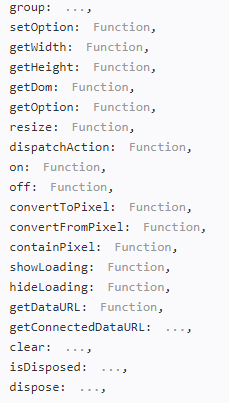
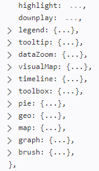
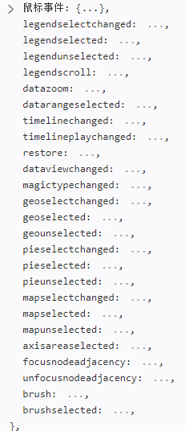

# echarts 使用
## 1.getStart
### 1.1引入 echart
```
  <!-- 引入 ECharts 文件 -->
    <script src="echarts.min.js"></script>
 ```
## 1.2异步调用
加载loading 动画
```
myChart.showLoading();
```
加载数据后隐藏loading
 ```
 myChart.hideLoading();
 ```
## 1.3动态数据
定时填入数据：
```
setInterval(function () {
    addData(true);
    myChart.setOption({
        xAxis: {
            data: date
        },
        series: [{
            name:'成交',
            data: data
        }]
    });
}, 500);

```
###1.4 图表中的交互
图例组件 legend、标题组件 title、视觉映射组件 visualMap、数据区域缩放组件 dataZoom、时间线组件 timeline

### 1.5代码触发 ECharts 中组件的行为
```
 setInterval(function () {
var dataLen = option.series[0].data.length;
// 取消之前高亮的图形
myChart2.dispatchAction({
type: 'downplay',
seriesIndex: 0,
dataIndex: app.currentIndex
});
app.currentIndex = (app.currentIndex + 1) % dataLen;
// 高亮当前图形
myChart2.dispatchAction({
type: 'highlight',
seriesIndex: 0,
dataIndex: app.currentIndex
});
// 显示 tooltip
myChart2.dispatchAction({
type: 'showTip',
seriesIndex: 0,
dataIndex: app.currentIndex
});
}, 1000);
```

### 1.6 使用svg
echart默认使用 canvas ,3.8以后可以使用svg渲染器；

```
// 使用 Canvas 渲染器（默认）
var chart = echarts.init(containerDom, null, {renderer: 'canvas'});
// 等价于：
var chart = echarts.init(containerDom);
// 使用 SVG 渲染器
var chart = echarts.init(containerDom, null, {renderer: 'svg'});
```
## 2.echart 方法
### 2.1 echarts 全局对象方法
1.init()
2.connect()
3.disconnect()
4.dispose()
5.getInstanceByDom()
6.registerMap();
7.getMap()
8.registerTheme();
9.graphic{ }

### 2.2 echartsInstance实例方法


## 2.3 action 


### 2.4 events



## n.其他问题 
### n.1标签问题问
设置显示标签，并组织标签中的内容。
 label:{
  normal:{
      show: true,
       // 定义显示提示内容
      formatter: '{b}:{c}'
  }
}
### n.2 使用百度作为底图
首先要引入两个js：
```
  <script src="http://api.map.baidu.com/api?v=2.0&ak=53oVIOgmSIejwV7EfphPgTynOZbIiVYu"></script>
  <script src="./js/bmap.min.js"></script>
```

在option 中多了一个bmap 的配置项。

```
var myChart = echarts.init(document.getElementById('main'));
myChart.setOption({
    bmap: {
        center: [120.13066322374, 30.240018034923],
        zoom: 14,
        roam: true,
                mapStyle: {
                       styleJson: [
          {
                    'featureType': 'land',     //调整土地颜色
                    'elementType': 'geometry',
                    'stylers': {
                              'color': '#081734'
                    }
          },
          {
                    'featureType': 'building',   //调整建筑物颜色
                    'elementType': 'geometry',
                    'stylers': {
                              'color': '#04406F'
                    }
          },
         {
                    'featureType': 'building',   //调整建筑物标签是否可视
                    'elementType': 'labels',
                    'stylers': {
                    'visibility': 'off'
                    }
          },
          {
                    'featureType': 'highway',     //调整高速道路颜色
                    'elementType': 'geometry',
                    'stylers': {
                    'color': '#015B99'
                    }
          },
          {
                    'featureType': 'highway',    //调整高速名字是否可视
                    'elementType': 'labels',
                    'stylers': {
                    'visibility': 'off'
                    }
          },
          {
                    'featureType': 'arterial',   //调整一些干道颜色
                    'elementType': 'geometry',
                    'stylers': {
                    'color':'#003051'
                    }
          },
          {
                    'featureType': 'arterial',
                    'elementType': 'labels',
                    'stylers': {
                    'visibility': 'off'
                    }
          },
          {
                    'featureType': 'green',
                    'elementType': 'geometry',
                    'stylers': {
                    'visibility': 'off'
                    }
          },
          {
                    'featureType': 'water',
                    'elementType': 'geometry',
                    'stylers': {
                              'color': '#044161'
                    }
          },
          {
                    'featureType': 'subway',    //调整地铁颜色
                    'elementType': 'geometry.stroke',
                    'stylers': {
                    'color': '#003051'
                    }
          },
          {
                    'featureType': 'subway',
                    'elementType': 'labels',
                    'stylers': {
                    'visibility': 'off'
                    }
          },
          {
                    'featureType': 'railway',
                    'elementType': 'geometry',
                    'stylers': {
                    'visibility': 'off'
                    }
          },
          {
                    'featureType': 'railway',
                    'elementType': 'labels',
                    'stylers': {
                    'visibility': 'off'
                    }
          },
          {
                    'featureType': 'all',     //调整所有的标签的边缘颜色
                    'elementType': 'labels.text.stroke',
                    'stylers': {
                              'color': '#313131'
                    }
          },
          {
                    'featureType': 'all',     //调整所有标签的填充颜色
                    'elementType': 'labels.text.fill',
                    'stylers': {
                              'color': '#FFFFFF'
                    }
          },
          {
                    'featureType': 'manmade',   
                    'elementType': 'geometry',
                    'stylers': {
                    'visibility': 'off'
                    }
          },
          {
                    'featureType': 'manmade',
                    'elementType': 'labels',
                    'stylers': {
                    'visibility': 'off'
                    }
          },
          {
                    'featureType': 'local',
                    'elementType': 'geometry',
                    'stylers': {
                    'visibility': 'off'
                    }
          },
          {
                    'featureType': 'local',
                    'elementType': 'labels',
                    'stylers': {
                    'visibility': 'off'
                    }
          },
          {
                    'featureType': 'subway',
                    'elementType': 'geometry',
                    'stylers': {
                              'lightness': -65
                    }
          },
          {
                    'featureType': 'railway',
                    'elementType': 'all',
                    'stylers': {
                              'lightness': -40
                    }
          },
          {
                    'featureType': 'boundary',
                    'elementType': 'geometry',
                    'stylers': {
                              'color': '#8b8787',
                              'weight': '1',
                              'lightness': -29
                    }
          }]
        }
    },
    series: [{
        type: 'scatter',
        coordinateSystem: 'bmap',
        data: [ [120, 30, 1] ]
    }]


});

var bmap = myChart.getModel().getComponent('bmap').getBMap();
bmap.addControl(new BMap.MapTypeControl());
```
